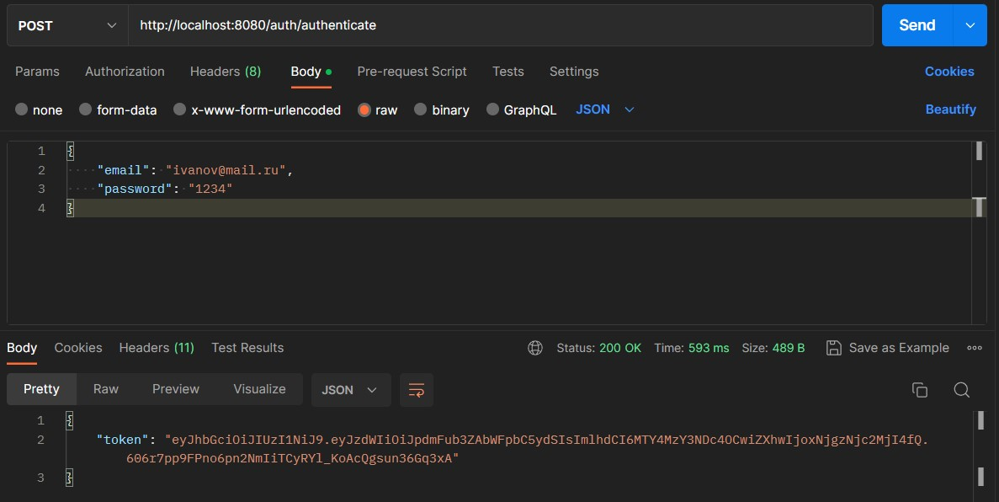
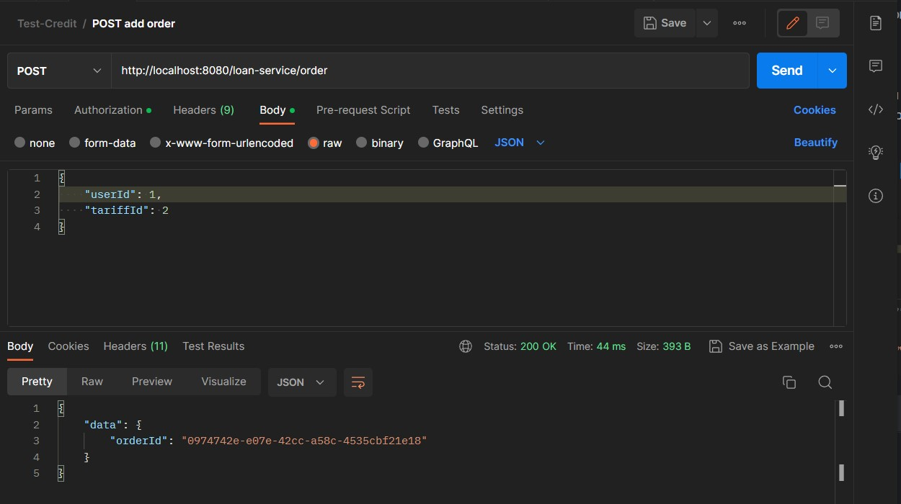
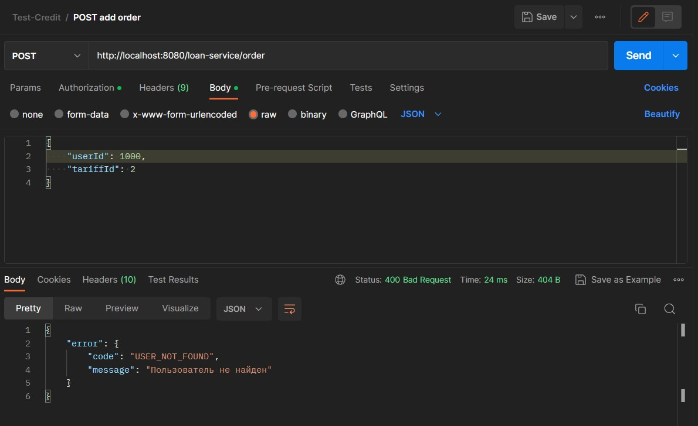

## _MTS-Credit_
Для развертки бд я использовал PostgreSQL. Поэтому перед тестированием необходимо:
- Зайти на официальный сайт PostgreSQL и загрузить установщик в соответсивии с вашей системой: https://www.enterprisedb.com/downloads/postgres-postgresql-downloads
- После установки, создайте пользователя с логином "user" и паролем: "1234". Далее для этого пользователя необходимо создать базу данных с названием "mts-credit"

## Как запустить проект

Необходимо написать следующие команды, находясь в директории проекта

```bash
mvn clean install

./mvnw package
java -jar target/Credit-Service-0.0.1-SNAPSHOT.jar
```


## Аутентификация
Для того, чтобы протестировать проект, необходимо пройти аутентификацию. Чтобы пройти аутентификацию, воспользуйтесь пользователем, который создается при запуске:
#### Authenticate
```
POST http://localhost:8080/auth/authenticate
```
#### Json Body
```
{
    "email": "ivanov@mail.ru",
    "password": "1234"
}
```

Сперва вы копируете сгенерированный токен. Далее переходите в любой метод, требующий авторизацию, выбираете способ "Bearer Token" и вставляете его.
Внимание: обязательно посмотрите пункт 3 в скриншотах перед тестированием!


## Скриншоты Postman

1) Авторизация

   

2) Подтверждение личности при запросе

   

3) Внимание! Так как реализована связь между таблицами "users" и "loan_order" userId несуществующего пользователя в таблице указывать нельзя

   

